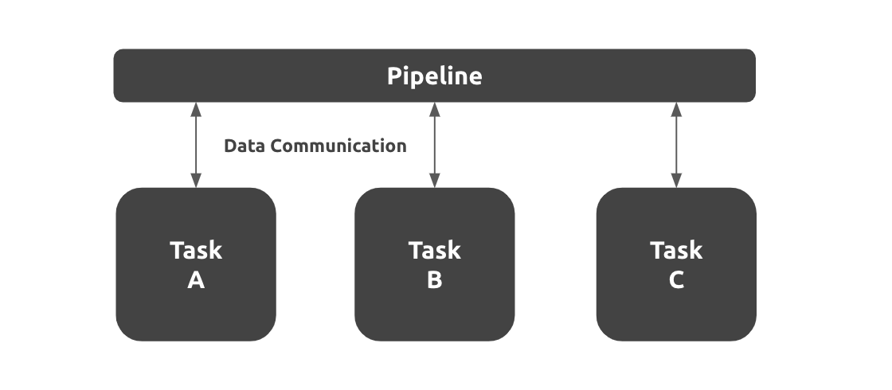

# 概要

## Overview
Podder.ai の アプリケーションは複数の独立したタスクと、パイプラインから構築されています。パイプラインはタスク間のデータの受け渡しや、実行順序、スケジューリングなどのオーケストレーションの役割を持っています。こちらがアプリケーションの全体像を示した図です。

### タスク
タスクは Podder.ai の最も重要な概念です。これは、ある AI アプリケーションの実行処理のステップの単位であり、単一の Docker コンテナ上で実行されます。 デフォルトでは以下の 3 つのタスクが準備されています。
- センサータスク
- メインタスク
- ライタータスク

### パイプライン

## Principles

## Tech Stack

