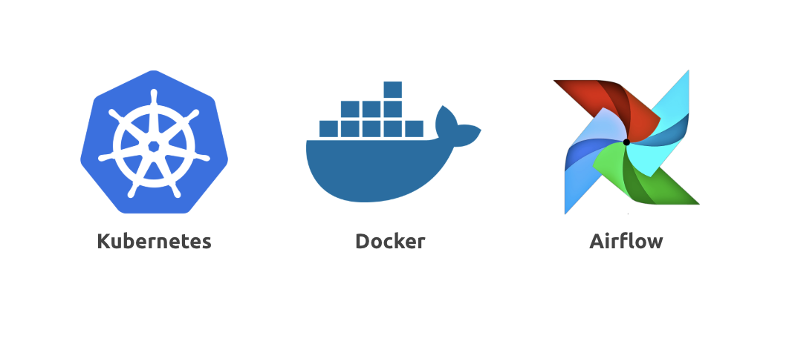

# 概要

## Overview
Podder.ai の アプリケーションは複数の独立したタスクと、パイプラインから構築されています。パイプラインはタスク間のデータの受け渡しや、実行順序、スケジューリングなどのオーケストレーションの役割を持っています。こちらがアプリケーションの全体像を示した図です。

### タスク
タスクは Podder.ai の最も重要な概念です。これは、ある AI アプリケーションの実行処理のステップの単位であり、単一のコンテナ上で実行されます。 デフォルトでは以下の 3 つのタスクが準備されています。
- センサータスク：インプットデータを取得するタスク
- メインタスク　：AI モデルを実行するタスク
- ライタータスク：結果を特定の場所に出力するタスク

これらのデフォルトタスクに加えて　Podder CLI を使用して新しいタスクを作成することもできます。

### パイプライン
パイプラインはタスクの集合を定義したものです。タスク間のデータの受け渡しや、実行順序、スケジューリングなどのオーケストレーションの役割を持っています。パイプラインは自由にカスタマイズすることが可能です。

## Principles
Podder.ai のアプリケーションは次のような基本方針に基づいて設計されています。
- 精度の最適化
- デプロイ先の自由度

### 精度の最適化
#### パイプラインの柔軟性
複数のタスクを柔軟に組み合わせることを可能にすることで、`一連の処理による精度の最適化`を行います。タスクごとに精度を確認できることで、どのタスクが全体の精度に影響を与えているか簡単に判別することを可能にします。また、問題のタスクだけを更新できることで、他のタスクに影響を与えることなく一連の処理の予測精度の最適化を行うことができます。

#### 業務やドメインに合わせたライブラリ
データバリデーションや、フォーマッター、オートコレクターなどの様々なライブラリを使用したタスクを追加することで、ドメインに合わせた AI ソリューションの提供が可能になります。これにより、`AI モデルの精度だけではなくトータルの精度向上`を行うことができます。

### どこでもデプロイ
オンプレミスや AWS、GCP などのプライベートクラウドといった、あらゆる環境に対してアプリケーションをデプロイできるようにします。また、顧客のセキュリティ要件や既存システムに合わせた環境構築ができることで、顧客ニーズに合わせたシステムインテグレーションを可能にします。

## Tech Stack
先ほど述べた基本方針を達成するために、Podder.ai では次の技術を採用しています。
- [Kubernetes](https://kubernetes.io/)
- [Docker](https://www.docker.com/)
- [Airflow](https://airflow.apache.org/)

Kubernetes と Docker を利用することで次のことが可能になります。
- コンテナ型仮想化
- マイクロサービス基盤
- ポータブルな基盤構築

タスクごとにコンテナを分けて管理することで、`リソースの再利用`が可能になります。これにより負荷が集中しているタスクに対して、効率的にスケールアウトすることができ、コストを抑えることができます。さらに、問題がある特定のタスクだけの更新などが可能で安定したアプリケーションの運用を可能にします。

また、Airflow を使うことでタスクの実行順序やスケジューリングを管理できます。`タスクの並列実行や前タスクの結果による処理分岐も可能`で、顧客ニーズに合わせて必要なタスクを追加することで、AI 精度の最適化を行うことができます。
