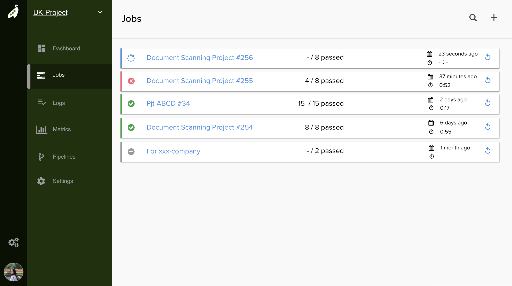

# 初めてのアプリケーション実行
## はじめに
早速 Podder.ai が提供しているサンプルプロジェクトを利用して、初めての AI アプリケーションを実行してみましょう。ここでは次のことを学習することができます。
- Podder.ai を使用するために必要なツールのインストール
- Podder.ai を使用した AI アプリケーションの振る舞い

## インストール
まずは Podder.ai を利用するために必要なツール `Podder CLI` をインストールしましょう。ターミナルを開いて以下のコマンドを入力してください。
```
$ pip install podder-cli
```
> `podder-cli` は、Podder.ai のコマンドラインインターフェースです。

## プロジェクトの作成
それでは、`podder init` コマンドを利用してプロジェクトを作成しましょう。以下のコマンドを入力して、Podder.ai が提供しているテンプレートプロジェクトを選択します。
```
$ podder init --template sample-podder
```
サンプルのプロジェクトが作成されたのが確認できると思います。

## アプリケーションの実行
次にプロジェクトフォルダ内に移動して、アプリケーションを立ち上げてみましょう。次のコマンドを入力してください。
```
$ cd sample-podder
$ podder pipeline run
```
> 最初の実行時はビルド処理が走るため少し時間がかかります。

アプリケーションが立ち上がったら `http://localhost:8080` にアクセスしてください。ダッシュボードが確認でき、ジョブが実行されていることが確認できると思います。



ジョブの完了を待ってからアウプットフォルダを確認すると、AI モデルによって解析された結果が出力されていることが確認できます。
```
$ cd output
$ ls
$ sample_outputs.json
```
> インプットフォルダ配下にあるデータが順次読まれて処理されています。

これで**初めてのアプリケーション実行**は完了です。Podder.ai を使用した AI アプリケーションがどのような振る舞いをするか理解できたかと思います。次はこのアプリケーションをデプロイしていきましょう。
