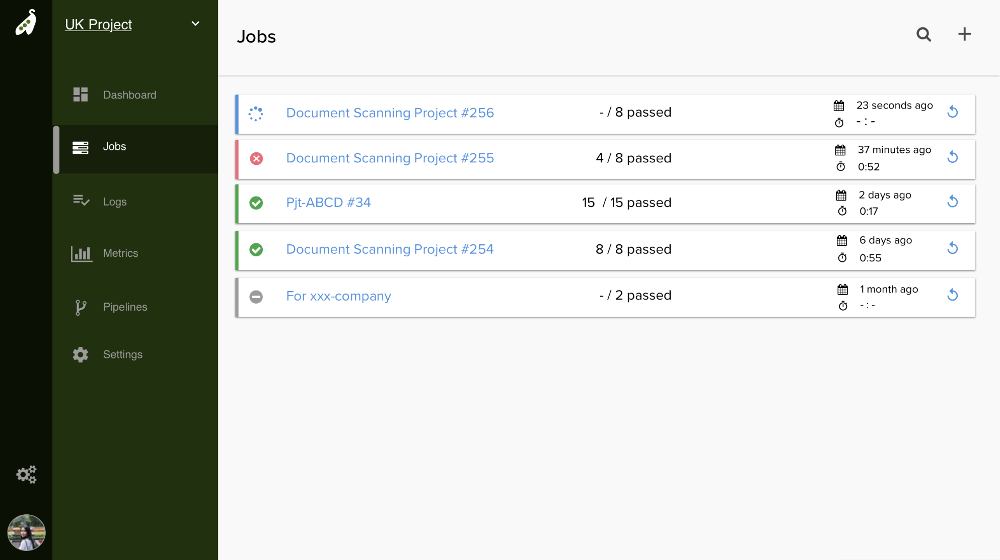

# アプリケーションのデプロイ
## はじめに
このチュートリアルでは、Podder.ai を使用して EC2 に構築した環境にアプリケーションをデプロイしてみましょう。このチュートリアルでは次のことが理解できます。
- EC2 上でのクラスターの構築方法
- Podder.ai アプリケーションのデプロイ手順
- アプリケーションの公開方法

## セットアップ
チュートリアルを始める前に以下の準備を行なってください。
- [AWS の登録](https://aws.amazon.com/jp/register-flow/)
- [EC2 の登録と AmazonLinux2 インスタンスの作成](https://aws.amazon.com/jp/ec2/)
- [キーペアの取得](https://docs.aws.amazon.com/ja_jp/AWSEC2/latest/UserGuide/ec2-key-pairs.html)
- [DockerHub](https://hub.docker.com/)

## クラスターの構築
早速`podder cluster`コマンドを利用してクラスターを構築しましょう。作成した EC2 インスタンス内で次のコマンドを入力してください。
```
$ podder cluster init
```
対話形式でクラスターの構築に必要な情報を入力できます。
> EC2 インスタンスの認証情報を事前に取得する必要があります。

入力が完了したら実際に環境を構築します。次のコマンドを入力してください。
```
$ cd podder cluster install
```
これでクラスターの構築は完了です。

## アプリケーションのビルド
次に皆さんが`パイプラインの設計`チュートリアルで作成した、アプリケーションをビルドします。ご自身のPCのターミナルから次のコマンドを入力してください。
```
$ cd ~/tutorial
$ podder package init
```
対話形式でアプリケーションのビルドに必要な情報を入力できます。
> DockerHub の認証情報を事前に取得する必要があります。

次にアプリケーションをビルドして、DockerHub にアップロードします。
```
$ podder package build
$ podder package push
```
DockerHub を確認すると Docker イメージが更新されていることが確認できます。

## アプリケーションのデプロイ
それでは、先ほど構築したクラスターにアプリケーションをデプロイしていきます。まずはデプロイ先などの設定を行います。次のコマンドをターミナルから入力してください。
```
$ podder deployment init
```
対話形式でアプリケーションのデプロイに必要な情報を入力できます。先ほど構築したデプロイ先の情報を入力します。
> デプロイ先の認証情報を事前に取得する必要があります。

設定が完了したら、次のコマンドを入力してアプリケーションをデプロイします。
```
$ podder deployment apply
```

デプロイが成功しているか確認してみましょう。STATUS が `Running` になっているとデプロイに成功しています。
```
$ kubectl get pods
NAME                          READY     STATUS    RESTARTS   AGE
hello-node-5f76cf6ccf-br9b5   1/1       Running   0          1m
```
これでアプリケーションのデプロイが完了しました。

## アプリケーションの公開
最後にブラウザ上からアクセスできるようにアプリケーションを公開しましょう。AWS のセキュリティーグループ設定から EC2 インスタンスの `30000` ポートを公開してください。

EC2 インスタンスの IP アドレスを確認してこちらにアクセスしてください。
`https://[your-ec2-ip]:30000`



デプロイ先の環境でアプリケーションが実行されていることが確認できます。

これでチュートリアルは終了です。Podder.ai を使用したサーバーの構築とアプリケーションのデプロイ方法が理解できたと思います。