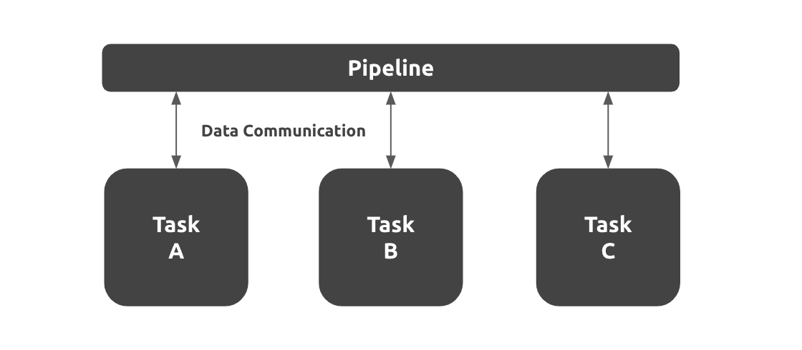

# Overview
The Podder.ai application is built from multiple independent tasks and a pipeline. Pipelines are responsible for passing data between tasks, and for orchestration such as execution order and scheduling. Here is a diagram showing the overall picture of the application.

### Task
Tasks are the most important concept of Podder.ai. This is a unit of steps in the application execution process and is performed on a single container. You can also add new tasks using the Podder CLI.

### Pipeline
A pipeline is a defined set of tasks. It has an orchestration role, such as passing data between tasks, execution order, and scheduling. The pipeline can be customized freely by the user.

## Principles
The application of Podder.ai is designed with the following basic policy.
- Accuracy optimization
- Deployment anywhere

### Accuracy optimization
#### Pipeline flexibility
It allows you to flexibly combine multiple tasks, and `optimizes the accuracy with a series of processes`. You can check the accuracy for each task and easily determine which tasks are affecting the overall accuracy. In addition, the ability to correct and update only the task in question enables optimization of the prediction accuracy of the series of processes without affecting other tasks.

#### Libraries tailored to business and domain
By adding tasks using data validation and various libraries such as formatter and autocollector, it becomes possible to provide an AI solution tailored to the domain. This makes it possible to `improve the overall accuracy of the AI model rather than by itself.

### Deployment anywhere
Deploy applications to any environment, including on-premises and private clouds such as AWS and GCP. In addition, by being able to design and build an environment that meets the customer's security requirements and existing systems, it enables system integration that meets the customer's needs.

## Tech Stack
Podder.ai uses the following technologies to achieve the basic policy described above.
- [Kubernetes](https://kubernetes.io/)
- [Docker](https://www.docker.com/)
- [Airflow](https://airflow.apache.org/)

By using **Kubernetes** and **Docker**, you can:
- Container-type virtualization
- Microservice platform
- Portable infrastructure construction

Container-based virtualization enables application deployment and operation in any customer environment as well. Also, by separately managing containers for each task, it is possible to `reuse resources`. This allows you to scale out efficiently for tasks that are load intensive, and keep costs down. Furthermore, only specific tasks that have problems can be corrected and updated, enabling stable application operations.

**Airflow** allows you to manage task execution order and scheduling. Parallel execution of tasks and processing branching according to the result of previous tasks are also possible, and optimization of AI accuracy can be performed by adding necessary tasks according to customer needs.
