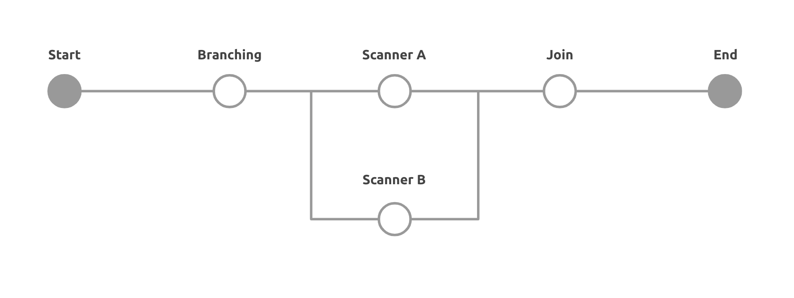

# Pipeline
A pipeline is a set of rules for defining a collection of tasks and their run order. Pipelines support complex job orchestration using a simple set of configuration keys to help you resolve failures sooner. (We are using [Airflow](https://airflow.apache.org/) to schedule and monitor pipelines.)

With Pipelines, you can:
- Run and troubleshoot tasks independently with real-time status feedback.
- Schedule pipeliens for tasks that should only run periodically.
- Run multiple tasks in parallel for efficient version testing.


## Configuration
You can define a collection of tasks and their run order in `config/pipeline.yml`.
```yaml
version: 1.0
tasks:                                  # Add your tasks here
  - task_name: sensor-task              # task name
    timeout: 45                         # timeout setting of task 
  - task_name: main-task
    timeout: 45
  - task_name: writer-task
    timeout: 45
dags:
  - dag_name: pipeline                  # your dag name
    schedule_interval: "* * * * *"      # modify this if you want to change schedule interval. (Cron expression)
    flows:                              # run order of tasks
      - task_name: sensor-task
        downstream_tasks:
          - podder-task
      - task_name: podder-task
        downstream_tasks:
          - writer-task
      - task_name: writer-task
task_log_format: "time:[%(time)s]\tname:%(name)s\ttaskname:%(taskname)s\tscriptinfo:[%(scriptinfo)s]\tloglevel:%(levelname)s\tprogresstime:%(progresstime)s\ttasktime:%(tasktime)s\tmessage:[%(message)s]"
task_log_level: DEBUG
sql_log_format: "time:[%(asctime)s]\tname:%(name)s\tloglevel:%(levelname)s\tmessage:[%(message)s]"
sql_log_level: WARN
```

## Start pipeline
You can start your pipeline by the following command.
```bash
$ podder pipelien start
```
Podder CLI read the configuration on pipeline.yml and start your pipeline.

TBD cannot execute podder pipeline ...

## Trigger Rules
You can configure trigger rule of each tasks in pipeline.yml. Here is an example.
```yaml
version: 1.0
tasks:
  - task_name: sensor-task
    timeout: 45
  - task_name: main-task
    timeout: 45
  - task_name: writer-task
    timeout: 45
    trigger_rule: ALL_DONE              # Trigger rule of task
```
Note that default trigger_rule is ALL_SUCCESS. Please refer to [Trigger Rules in Airflow Document](https://airflow.apache.org/concepts.html?highlight=triggerrule#trigger-rules) for more detail.


## Branching Tasks
You can configure branching tasks in pipeline. The below diagram shows the overview how branching looks like. Normally, you will have a task for branching and multiple tasks in down streams.



### Define Branching
First of all, you need to define how to branch tasks. Here is an example of pipeline.yml.
```yaml
version: 1.0
tasks:
  - task_name: branching-task
    timeout: 120
  - task_name: scanner-a-task
    timeout: 120
  - task_name: scanner-b-task
    timeout: 120
  - task_name: join-task
    timeout: 120
    trigger_rule: ALL_DONE
dags:
  - dag_name: pipeline
    schedule_interval: "* * * * *"
    max_active_runs: 1
    flows:
      - task_name: branching-task
        downstream_tasks:
          - scanner-a-task
          - scanner-b-task
      - task_name: scanner-a-task
        downstream_tasks:
          - join-task
      - task_name: scanner-b-task
        downstream_tasks:
          - join-task
      - task_name: join-task
・・・
```

As you can see, two downstream tasks are defined on `branching-task` in flows. So, branching task has two options to pass data into down stream tasks.

### Configure Next Task
After defined how to branch your task, you need to configure next task for job data inside `branching-task`. Here is an example of `branching-task/app/task.py`.
```py
・・・
class Task(BaseTask):

    def execute(self, inputs: List[Any]) -> List[Any]:
        self.logger.debug("Start executing...")
        self.logger.debug("inputs: {}".format(inputs))

        outputs = []
        for input_data in inputs:
            # Add your condition
            next_tasks = ["scanner-a-task"]
            # Put next task list
            input_data["job_data"]["params"]["next_tasks"] = next_tasks
            outputs.append(input_data)

        self.logger.debug("outputs: {}".format(outputs))
        self.logger.debug("Complete executing.")
        return outputs
・・・
```

To configure next task on branching-task, you need to pass next task names on each data. Then, pipeline knows which data should be passed to which task and allocate them respectively. In this example, data will be passed to only `scanner-a-task`. If you did not specify task name, data will be passed to both tasks.